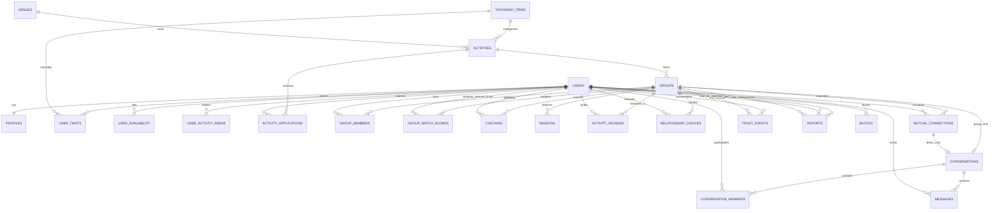

# Talent MVP ERD Draft v0.1

This ERD is optimized for the first MVP rather than full commercialization.

## 1. Entity Overview

### users
Authentication identity and account state.

Fields:
- id: uuid PK
- phone_hash: text UNIQUE NOT NULL
- status: enum(active, suspended, deleted) NOT NULL
- birth_year: smallint NOT NULL
- verified_at: timestamptz NULL
- created_at: timestamptz NOT NULL
- updated_at: timestamptz NOT NULL

Notes:
- Raw phone numbers should not be exposed broadly to application queries.
- Minimum-age validation belongs in signup policy.

### profiles
Public-facing profile data.

Fields:
- user_id: uuid PK/FK -> users.id
- nickname: varchar(40) NOT NULL
- bio: varchar(160) NULL
- occupation_category: varchar(80) NULL
- profile_photo_url: text NULL
- age_band: varchar(20) NOT NULL
- created_at: timestamptz NOT NULL
- updated_at: timestamptz NOT NULL

### taxonomy_items
Unified taxonomy for GIVE / GET / INTEREST and activity themes.

Fields:
- id: uuid PK
- type: enum(skill, interest, activity_category) NOT NULL
- slug: varchar(80) UNIQUE NOT NULL
- name_ko: varchar(80) NOT NULL
- name_en: varchar(80) NULL
- active: boolean NOT NULL DEFAULT true

### user_traits
Stores GIVE, GET, and INTEREST selections.

Fields:
- id: uuid PK
- user_id: uuid FK -> users.id NOT NULL
- taxonomy_item_id: uuid FK -> taxonomy_items.id NOT NULL
- trait_type: enum(give, get, interest) NOT NULL
- self_level: smallint NULL
- created_at: timestamptz NOT NULL

Constraints:
- UNIQUE(user_id, taxonomy_item_id, trait_type)

Indexes:
- (user_id, trait_type)
- (taxonomy_item_id, trait_type)

### user_availability
Recurring broad availability.

Fields:
- id: uuid PK
- user_id: uuid FK -> users.id NOT NULL
- weekday: smallint NOT NULL
- start_minute: smallint NOT NULL
- end_minute: smallint NOT NULL
- created_at: timestamptz NOT NULL

### user_activity_areas
Broad preferred activity areas, not home address.

Fields:
- id: uuid PK
- user_id: uuid FK -> users.id NOT NULL
- area_code: varchar(40) NOT NULL
- label: varchar(100) NOT NULL
- created_at: timestamptz NOT NULL

Constraints:
- UNIQUE(user_id, area_code)

### venues
Approved public meeting locations.

Fields:
- id: uuid PK
- name: varchar(120) NOT NULL
- category: varchar(60) NOT NULL
- address_text: text NOT NULL
- area_code: varchar(40) NOT NULL
- latitude: numeric(9,6) NULL
- longitude: numeric(9,6) NULL
- safety_approved: boolean NOT NULL DEFAULT false
- active: boolean NOT NULL DEFAULT true
- created_at: timestamptz NOT NULL

### activities
Activity session visible to users.

Fields:
- id: uuid PK
- category_id: uuid FK -> taxonomy_items.id NOT NULL
- title: varchar(120) NOT NULL
- description: text NULL
- goal: text NOT NULL
- venue_id: uuid FK -> venues.id NULL
- area_code: varchar(40) NOT NULL
- starts_at: timestamptz NOT NULL
- ends_at: timestamptz NOT NULL
- min_participants: smallint NOT NULL DEFAULT 3
- target_participants: smallint NOT NULL DEFAULT 4
- max_participants: smallint NOT NULL DEFAULT 5
- status: enum(open, matching, confirmed, active, completed, cancelled) NOT NULL
- source: enum(system, admin) NOT NULL
- created_at: timestamptz NOT NULL
- updated_at: timestamptz NOT NULL

Indexes:
- (status, starts_at)
- (area_code, starts_at)
- (category_id, starts_at)

### activity_applications
User intent to join an activity.

Fields:
- id: uuid PK
- activity_id: uuid FK -> activities.id NOT NULL
- user_id: uuid FK -> users.id NOT NULL
- status: enum(applied, waitlisted, selected, cancelled, rejected) NOT NULL
- applied_at: timestamptz NOT NULL
- updated_at: timestamptz NOT NULL

Constraints:
- UNIQUE(activity_id, user_id)

Indexes:
- (activity_id, status)
- (user_id, status)

### groups
Actual formed group for an activity.

Fields:
- id: uuid PK
- activity_id: uuid FK -> activities.id NOT NULL
- status: enum(forming, confirmed, active, completed, cancelled) NOT NULL
- match_version: varchar(40) NOT NULL
- created_at: timestamptz NOT NULL
- confirmed_at: timestamptz NULL
- completed_at: timestamptz NULL

### group_members
Membership and attendance state.

Fields:
- group_id: uuid FK -> groups.id NOT NULL
- user_id: uuid FK -> users.id NOT NULL
- role: enum(member, facilitator) NOT NULL DEFAULT member
- attendance_status: enum(expected, checked_in, absent, excused) NOT NULL DEFAULT expected
- joined_at: timestamptz NOT NULL

Primary Key:
- (group_id, user_id)

Indexes:
- (user_id, attendance_status)

### group_match_scores
Explainable matching diagnostics.

Fields:
- id: uuid PK
- group_id: uuid FK -> groups.id NOT NULL
- user_id: uuid FK -> users.id NOT NULL
- complementarity_score: numeric(5,4) NOT NULL
- interest_score: numeric(5,4) NOT NULL
- time_location_score: numeric(5,4) NOT NULL
- reliability_score: numeric(5,4) NOT NULL
- diversity_score: numeric(5,4) NOT NULL
- novelty_score: numeric(5,4) NOT NULL
- total_score: numeric(5,4) NOT NULL
- explanation_json: jsonb NULL
- created_at: timestamptz NOT NULL

This table is internal and never displayed as a user attractiveness score.

### checkins
Attendance evidence.

Fields:
- id: uuid PK
- group_id: uuid FK -> groups.id NOT NULL
- user_id: uuid FK -> users.id NOT NULL
- checked_in_at: timestamptz NOT NULL
- method: enum(app, admin) NOT NULL
- coarse_area_code: varchar(40) NULL

Constraints:
- UNIQUE(group_id, user_id)

### missions
AI-generated or fallback activity mission.

Fields:
- id: uuid PK
- group_id: uuid FK -> groups.id NOT NULL
- version: integer NOT NULL
- source: enum(ai, fallback, admin) NOT NULL
- title: varchar(120) NOT NULL
- goal: text NOT NULL
- total_minutes: smallint NOT NULL
- mission_json: jsonb NOT NULL
- safety_validated: boolean NOT NULL DEFAULT false
- created_at: timestamptz NOT NULL

### activity_reviews
Private post-activity feedback.

Fields:
- id: uuid PK
- group_id: uuid FK -> groups.id NOT NULL
- reviewer_user_id: uuid FK -> users.id NOT NULL
- satisfaction: smallint NOT NULL
- mission_helpfulness: smallint NULL
- would_join_similar: boolean NULL
- safety_issue: boolean NOT NULL DEFAULT false
- feedback_text: text NULL
- created_at: timestamptz NOT NULL

Constraints:
- UNIQUE(group_id, reviewer_user_id)

### relationship_choices
Private directional choice after completion.

Fields:
- id: uuid PK
- group_id: uuid FK -> groups.id NOT NULL
- from_user_id: uuid FK -> users.id NOT NULL
- to_user_id: uuid FK -> users.id NOT NULL
- choice_type: enum(group_again, another_activity, project, personal_interest, none) NOT NULL
- created_at: timestamptz NOT NULL
- updated_at: timestamptz NOT NULL

Constraints:
- UNIQUE(group_id, from_user_id, to_user_id)
- CHECK(from_user_id <> to_user_id)

Security rule:
- Directional choices are private and must not be readable by the target user.

### mutual_connections
Created only when relationship policy allows a mutual connection.

Fields:
- id: uuid PK
- user_low_id: uuid FK -> users.id NOT NULL
- user_high_id: uuid FK -> users.id NOT NULL
- origin_group_id: uuid FK -> groups.id NOT NULL
- connection_type: enum(group_again, activity, project, personal) NOT NULL
- status: enum(active, ended, blocked) NOT NULL
- created_at: timestamptz NOT NULL

Constraints:
- user_low_id < user_high_id using deterministic UUID ordering logic at service layer
- UNIQUE(user_low_id, user_high_id, connection_type, origin_group_id)

### conversations
Chat container.

Fields:
- id: uuid PK
- type: enum(group, direct) NOT NULL
- group_id: uuid FK -> groups.id NULL
- mutual_connection_id: uuid FK -> mutual_connections.id NULL
- created_at: timestamptz NOT NULL

Constraints:
- group chat requires group_id
- direct chat requires mutual_connection_id

### conversation_members
Fields:
- conversation_id: uuid FK -> conversations.id NOT NULL
- user_id: uuid FK -> users.id NOT NULL
- joined_at: timestamptz NOT NULL
- left_at: timestamptz NULL

Primary Key:
- (conversation_id, user_id)

### messages
Fields:
- id: uuid PK
- conversation_id: uuid FK -> conversations.id NOT NULL
- sender_user_id: uuid FK -> users.id NOT NULL
- body: text NOT NULL
- created_at: timestamptz NOT NULL
- deleted_at: timestamptz NULL

Indexes:
- (conversation_id, created_at)

### trust_events
Internal reliability/safety event ledger.

Fields:
- id: uuid PK
- user_id: uuid FK -> users.id NOT NULL
- event_type: enum(verified, attended, no_show, late_cancel, report_upheld, report_dismissed, admin_adjustment) NOT NULL
- source_group_id: uuid FK -> groups.id NULL
- weight: numeric(6,2) NOT NULL
- metadata: jsonb NULL
- created_at: timestamptz NOT NULL

Trust values are internal. User UI should expose badges/signals, not a raw score.

### reports
Fields:
- id: uuid PK
- reporter_user_id: uuid FK -> users.id NOT NULL
- reported_user_id: uuid FK -> users.id NULL
- group_id: uuid FK -> groups.id NULL
- category: enum(harassment, unsafe_behavior, impersonation, spam, discrimination, sexual_misconduct, other) NOT NULL
- description: text NULL
- status: enum(open, reviewing, actioned, dismissed) NOT NULL
- created_at: timestamptz NOT NULL
- resolved_at: timestamptz NULL

### blocks
Fields:
- blocker_user_id: uuid FK -> users.id NOT NULL
- blocked_user_id: uuid FK -> users.id NOT NULL
- created_at: timestamptz NOT NULL

Primary Key:
- (blocker_user_id, blocked_user_id)

CHECK:
- blocker_user_id <> blocked_user_id

---

## 2. Mermaid ERD

---

## 3. Privacy Boundaries

### Highly sensitive / restricted access
- phone_hash / authentication identifiers
- reports
- trust_events
- directional relationship_choices
- moderation metadata

### Public to confirmed group only
- nickname
- age band
- GIVE / GET / INTEREST
- limited profile photo
- activity participation information

### Never expose by default
- exact home address
- precise continuous GPS location
- raw Trust Score
- who selected the user unilaterally for personal interest
- phone number

---

## 4. Important Transaction Rules

### Group confirmation
A group should be confirmed atomically so the same user cannot be selected into overlapping activities.

### Mutual connection
When a relationship choice is written:
1. Save/replace the directional choice.
2. Query the reciprocal directional choice in the same completed group.
3. If policy-compatible choices are mutual, create `mutual_connections` using an idempotent unique key.
4. Create direct `conversation` only after the mutual connection exists.
5. Never notify either party about a non-mutual personal-interest choice.

### Blocking
Creating a block should immediately:
- prevent new direct/group matching where feasible
- hide direct conversation interaction
- suppress future mutual connection creation between the pair

---

## 5. Deferred Tables

Not included in first MVP schema unless implementation needs them:
- subscriptions
- payment_methods
- deposits
- venue_partnerships
- hosts
- promotions
- organizations
- enterprise_programs

These belong to later phases after offline activity quality is validated.
